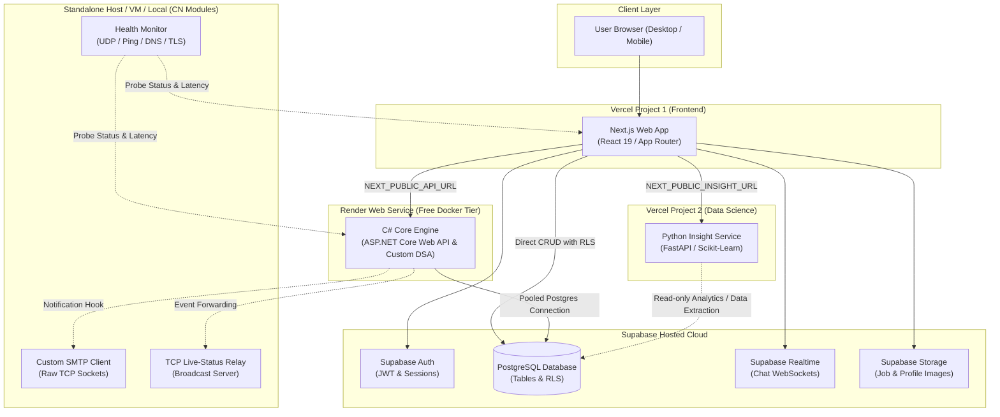

# ProLink

**ProLink** is an on-demand service marketplace web platform connecting customers with trusted local service professionals (plumbing, electrical wiring, painting, HVAC, and carpentry). Customers post structured service requests, and our high-performance algorithmic matching engine ranks and connects suitable professionals. Professionals submit custom offers, customers accept and negotiate terms via realtime chat, and transactions conclude with authenticated reviews. The system also equips administrators with management dashboards, category taxonomies, and analytics reports.

---

## 🚀 Quick Start: Running the Website

Ensure you have **Node.js (LTS >= 20.x)** and **npm** installed.

### 🍎 On macOS / Linux

1. **Navigate to the `web/` directory**:
   ```bash
   cd web
   ```

2. **Create the local environment file (`.env.local`)**:
   ```bash
   cp ../.env.example .env.local
   ```
   > Make sure your `web/.env.local` includes the Supabase credentials:
   > ```env
   > NEXT_PUBLIC_SUPABASE_URL=https://yevrgmanogofvuxlpasd.supabase.co
   > NEXT_PUBLIC_SUPABASE_ANON_KEY=sb_publishable_8Xcq4WGAN06UQomk90vCrA_yiSak3fX
   > NEXT_PUBLIC_SUPABASE_PUBLISHABLE_KEY=sb_publishable_8Xcq4WGAN06UQomk90vCrA_yiSak3fX
   > NEXT_PUBLIC_API_URL=http://localhost:5000
   > NEXT_PUBLIC_INSIGHT_URL=http://localhost:8000
   > ```

3. **Install dependencies**:
   ```bash
   npm install
   ```

4. **Start the local development server**:
   ```bash
   npm run dev
   ```

5. Open **[http://localhost:3000](http://localhost:3000)** in your browser.

---

### 🪟 On Windows

#### Option A: PowerShell
1. **Navigate to the `web/` directory**:
   ```powershell
   cd web
   ```

2. **Create the local environment file (`.env.local`)**:
   ```powershell
   Copy-Item ..\.env.example .env.local
   ```
   *(Ensure Supabase keys are configured in `web\.env.local`)*

3. **Install dependencies**:
   ```powershell
   npm install
   ```

4. **Start the development server**:
   ```powershell
   npm run dev
   ```

5. Open **[http://localhost:3000](http://localhost:3000)** in your browser.

#### Option B: Command Prompt (CMD)
```cmd
cd web
copy ..\.env.example .env.local
npm install
npm run dev
```
Open **[http://localhost:3000](http://localhost:3000)** in your browser.

---

## 1. System Architecture



---

## 2. Tech Stack

| Layer / Component | Technology | Hosting / Infrastructure |
| :--- | :--- | :--- |
| **Frontend** | Next.js (React, TypeScript, Tailwind CSS) | Vercel (Free tier, Project 1) |
| **Core Engine API** | C# ASP.NET Core Web API (.NET 8/9, Custom DSA Library) | Render (Free Web Service Docker container) |
| **Insight Service** | Python 3.12, FastAPI, Scikit-Learn, Pandas, NumPy | Vercel (Free tier, Project 2) |
| **Database & Auth** | PostgreSQL (RLS), Supabase Auth (JWT), Supabase Storage | Supabase Hosted Cloud (Free tier) |
| **Realtime Messaging** | Supabase Realtime (WebSockets) | Supabase Hosted Cloud |
| **Computer Networks** | Custom Sockets (TCP SMTP, UDP Health Monitor, TCP Relay) | Localhost / Standalone VM |

---

## 3. Repository Structure

```text
prolink/
├── README.md                      # Root documentation and project guide
├── .gitignore                     # Git ignore rules for Node, .NET, Python, data, and OS files
├── .gitattributes                 # Line ending normalization (LF) and binary definitions
├── .editorconfig                  # Code style and indentation rules across tools
├── .env.example                   # Environment variable template (no real secrets)
├── .vscode/
│   └── extensions.json            # Recommended VS Code and Antigravity extensions
├── .github/
│   └── workflows/                 # CI/CD automation pipelines (.gitkeep)
├── web/                           # Next.js frontend application (App Router)
├── api/                           # C# Core Engine (ASP.NET Core Web API & custom DSA library)
│   ├── Dockerfile                 # Container packaging for Render deployment
│   ├── ProLink.Engine/            # Standalone DSA library (Trie, Min-Heap, Merge Sort, Dijkstra)
│   ├── ProLink.Engine.Tests/      # xUnit test suite for DSA correctness
│   ├── ProLink.Bench/             # BenchmarkDotNet benchmarking harness
│   └── ProLink.Api/               # REST API host, controllers, and Supabase JWT verification
├── insight/                       # Python Insight Service (Intro to Data Science)
│   ├── main.py                    # FastAPI application entry point
│   ├── requirements.txt           # Python dependencies (fastapi, scikit-learn, etc.)
│   ├── app/                       # Category classifier, ranking scores, analytics
│   ├── generator/                 # Synthetic dataset generator using Faker
│   ├── notebooks/                 # Jupyter notebooks for EDA and model training
│   ├── data/                      # Raw, processed, and synthetic data directories
│   ├── models/                    # Serialized machine learning models (.pkl)
│   └── tests/                     # pytest automated tests
├── network/                       # Computer Networks modules (runs beside core platform)
│   ├── smtp-client/               # Socket-level custom SMTP client (RFC 5321 over TCP)
│   ├── health-monitor/            # UDP heartbeat listener, ICMP ping, DNS/TLS timing monitor
│   ├── tcp-relay/                 # Optional live broadcast TCP relay server
│   ├── packet-tracer/             # Cisco Packet Tracer (.pkt) network topology files
│   ├── captures/                  # Wireshark packet capture analysis files (.pcapng)
│   └── report/                    # Computer Networks lab report and documentation
├── db/                            # Database migrations, RLS policies, and seed data
│   ├── migrations/                # Sequentially numbered SQL migrations (001_schema.sql, etc.)
│   └── seed/                      # Demo users, service categories, and sample jobs
└── docs/                          # Specifications, decisions, and course deliverables
    ├── architecture.md            # System architecture details and service contracts
    ├── decisions/                 # Architectural Decision Records (ADRs) and instructor notes
    ├── api/                       # Cross-service JSON request/response contracts
    └── reports/                   # Reports for DSA, IDS, and CN course deliverables
```

---

## 4. Folder Ownership & Team Roles

| Role | Team Member | Primary Ownership | Secondary / Review Ownership |
| :--- | :--- | :--- | :--- |
| **P1** | Product / Data Lead | `db/`, `docs/`, `network/` (Lead) | General Architecture Review |
| **P2** | Frontend Lead | `web/` | `docs/api/` (Client Contracts) |
| **P3** | C# Engine Lead | `api/` | `network/` (Reviewer), `docs/reports/dsa/` |
| **P4** | Data Science Lead | `insight/` | `docs/reports/ids/` |

---

## 5. Prerequisites & Environment

All 4 team members must use matching major runtime versions across Mac and Windows workstations:

- **Git**: `>= 2.40`
- **VS Code** or **Google Antigravity** (Install recommended extensions from `.vscode/extensions.json`)
- **Node.js**: LTS version `>= 20.x`
- **.NET SDK**: `>= 8.0` (or `9.0` per team consensus)
- **Python**: `3.12.x`
- **Docker Desktop**: *(Optional)* Only required for members verifying the `api/Dockerfile` locally.
- **Wireshark & Cisco Packet Tracer**: *(Optional)* Required only for `network/` module development.

> [!NOTE]
> Version pin configurations (`.nvmrc` for Node and `global.json` for .NET) are currently `TODO` and will be committed once exact minor runtime versions are locked across the team.

---

## 6. Getting Started (Per Component)

These commands are to be executed when initialization of each component begins.

### A. Frontend (`web/`)
```bash
# 1. Initialize Next.js inside web/ (run from repo root)
npx create-next-app@latest web --typescript --app --tailwind --eslint --use-npm

# 2. Navigate and install Supabase dependencies
cd web
npm install @supabase/supabase-js @supabase/ssr

# 3. Start local development server
npm run dev
```

### B. Core Engine API (`api/`)
```bash
# 1. Initialize solution and projects (run from repo root)
dotnet new sln -n ProLink -o api
dotnet new classlib -n ProLink.Engine -o api/ProLink.Engine
dotnet new xunit -n ProLink.Engine.Tests -o api/ProLink.Engine.Tests
dotnet new console -n ProLink.Bench -o api/ProLink.Bench
dotnet new webapi -n ProLink.Api -o api/ProLink.Api

# 2. Add projects to solution & configure references
dotnet sln api/ProLink.sln add api/ProLink.Engine/ProLink.Engine.csproj
dotnet sln api/ProLink.sln add api/ProLink.Engine.Tests/ProLink.Engine.Tests.csproj
dotnet sln api/ProLink.sln add api/ProLink.Bench/ProLink.Bench.csproj
dotnet sln api/ProLink.sln add api/ProLink.Api/ProLink.Api.csproj

dotnet add api/ProLink.Engine.Tests reference api/ProLink.Engine
dotnet add api/ProLink.Bench reference api/ProLink.Engine
dotnet add api/ProLink.Api reference api/ProLink.Engine

# 3. Run test suites and start API
dotnet test api/ProLink.sln
dotnet run --project api/ProLink.Api
```

### C. Insight Service (`insight/`)

#### On macOS / Linux:
```bash
# 1. Create and activate virtual environment
python3.12 -m venv .venv
source .venv/bin/activate

# 2. Install dependencies & run service
pip install -r insight/requirements.txt
uvicorn insight.main:app --reload --port 8000
```

#### On Windows:
```cmd
:: 1. Create and activate virtual environment
py -3.12 -m venv .venv
.venv\Scripts\activate

:: 2. Install dependencies & run service
pip install -r insight\requirements.txt
uvicorn insight.main:app --reload --port 8000
```

### D. Database (`db/`)
1. Open the **SQL Editor** in the Supabase project web dashboard.
2. Execute migration files in order: `db/migrations/001_schema.sql`, followed by `002_rls.sql`, etc.
3. Apply demo seeds from `db/seed/` as needed.
4. *Rule*: The SQL files in `db/migrations/` are the authoritative source of truth. Always commit migration files before executing SQL in Supabase.

---

## 7. Deployment Overview

- **Frontend (`web/`)**: Deployed on **Vercel** (Root Directory configured to `web`).
- **Insight Service (`insight/`)**: Deployed on **Vercel** as a second standalone project (Root Directory configured to `insight`).
- **C# Core Engine (`api/`)**: Deployed on **Render** as a Docker web service using `api/Dockerfile`.
  - *Render Free Tier Notice*: Render instances spin down after ~15 minutes of inactivity. The first inbound request may experience a 30–50 second cold-start latency.
- **Database & Realtime (`db/`)**: Hosted on **Supabase**.
  - *Supabase Free Tier Notice*: Inactive free projects are paused after 7 days without queries.
- **Network Modules (`network/`)**: Executed locally or on a standalone cloud VM (Vercel serverless functions cannot bind raw TCP/UDP listener sockets).

---

## 8. Environment Variables

All variables are listed with empty placeholders in [`.env.example`](file:///.env.example). **Never commit real secrets or `.env` files to git.**

| Variable Name | Consumed By | Where It Is Configured | Description |
| :--- | :--- | :--- | :--- |
| `NEXT_PUBLIC_SUPABASE_URL` | Frontend (`web`) | Vercel Environment / `.env.local` | Supabase project API gateway URL |
| `NEXT_PUBLIC_SUPABASE_ANON_KEY` | Frontend (`web`) | Vercel Environment / `.env.local` | Public client-safe Supabase anon key |
| `NEXT_PUBLIC_API_URL` | Frontend (`web`) | Vercel Environment / `.env.local` | Base URL of Core Engine API (Render or localhost) |
| `NEXT_PUBLIC_INSIGHT_URL` | Frontend (`web`) | Vercel Environment / `.env.local` | Base URL of Python Insight Service (Vercel or localhost) |
| `SUPABASE_URL` | Core Engine / Insight | Render / Vercel Environment | Internal Supabase REST endpoint |
| `SUPABASE_SERVICE_ROLE_KEY` | Core Engine / Insight | Render / Vercel (**Server Only**) | Privileged Supabase key (bypasses RLS; NEVER in web) |
| `SUPABASE_JWT_SETTINGS` | Core Engine (`api`) | Render Environment | Secret / key verification parameters for JWT validation |
| `DATABASE_URL` | Core Engine (`api`) | Render Environment | Supabase PostgreSQL pooled connection string |
| `INSIGHT_URL` | Core Engine (`api`) | Render Environment | Internal service endpoint for Insight microservice |
| `ALLOWED_ORIGINS` | Core Engine / Insight | Render / Vercel Environment | CORS allowed web origins (e.g. `https://prolink.vercel.app`) |
| `SMTP_HOST` | Network (`network`) | Local environment / VM | Target SMTP mail server hostname |
| `SMTP_PORT` | Network (`network`) | Local environment / VM | Target SMTP mail server port (e.g., 587 or 25) |
| `SMTP_USER` | Network (`network`) | Local environment / VM | Authentication username for SMTP relay |
| `SMTP_PASSWORD` | Network (`network`) | Local environment / VM | Authentication password for SMTP relay |

---

## 9. Team Workflow (Single Main Branch)

The team operates on a unified `main` trunk branch:

1. **Folder Boundary Isolation**: Each team member works primarily within their designated directory (`web/`, `api/`, `insight/`, `db/`, `network/`, `docs/`) to eliminate merge conflicts.
2. **Rebase Before Push**: Always synchronize before pushing changes:
   ```bash
   git pull --rebase origin main
   git push origin main
   ```
3. **Small, Frequent Commits**: Commit atomic, logical units of work frequently with clear commit messages.
4. **Never Force Push**: Never run `git push --force` or overwrite commit history on `main`.
5. **Never Commit Secrets**: Real `.env` files, credentials, and API keys are strictly excluded via `.gitignore`.
6. **Local Testing Prior to Push**: Pushes to `main` trigger automated deployments on Vercel and Render. Always test builds locally before pushing.

---

## 10. Cross-Platform Guidelines (Mac & Windows)

- **Line Endings**: `.gitattributes` enforces `eol=lf` across all text files. Avoid modifying line ending configurations.
- **No Bash-Only Scripts**: Do not add `.sh` scripts that will fail on Windows without WSL/Git Bash. Document cross-platform shell commands explicitly.
- **Case-Sensitive Naming**: Use strictly `lowercase-kebab-case` for directory and file names (except C# project directories, which use `PascalCase`). Linux hosts (Vercel/Render) are strictly case-sensitive.

---

## 11. Backend Swap Note

> [!NOTE]
> If the team decides to replace the C# ASP.NET Core backend with Python:
> 1. The DSA and matching algorithms will be migrated to Python within `insight/` (or a dedicated Python API).
> 2. The `api/` folder and Render deployment will be removed.
> 3. The frontend needs zero refactoring — only `NEXT_PUBLIC_API_URL` and API contracts in `docs/api/` will change.

---

## 12. Project Status & Roadmap

- [x] Initial monorepo directory layout & placeholder files
- [x] Baseline configuration (`.gitignore`, `.gitattributes`, `.editorconfig`, `.vscode`)
- [x] Architecture documentation & cross-service design contracts
- [ ] Supabase database schema (`001_schema.sql`) & RLS policies (`002_rls.sql`)
- [ ] Next.js walking skeleton & Supabase Auth integration
- [ ] C# Core Engine setup (`ProLink.Engine` & `ProLink.Api` HTTP skeleton)
- [ ] Python Insight Service FastAPI skeleton & synthetic data generator
- [ ] DSA custom structures (Trie, Min-Heap, Inverted Index, Dijkstra)
- [ ] Computer Networks standalone modules (SMTP client, Health Monitor)
- [ ] End-to-end integration & cloud deployment (Vercel + Render + Supabase)
