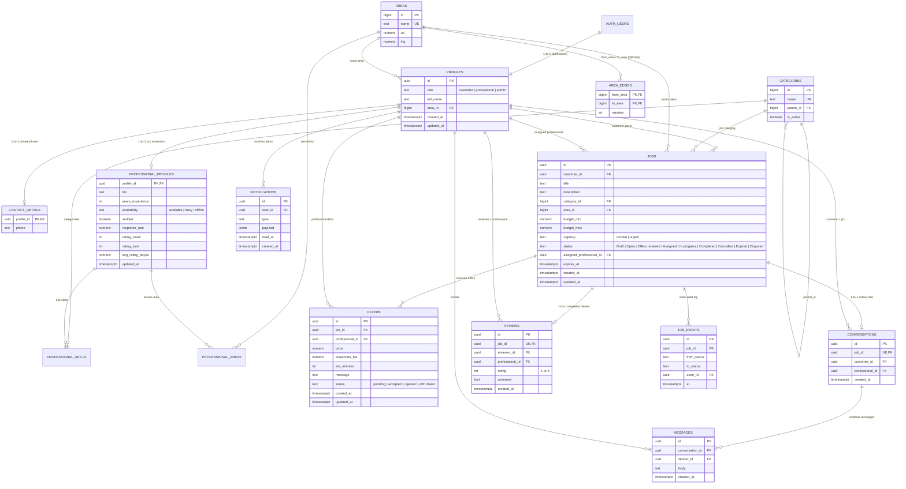

# ProLink Database Architecture (`db/`)

## Purpose
This directory contains the authoritative PostgreSQL database schema, helper functions, Row Level Security (RLS) policies, seed datasets, and policy validation test scripts for ProLink on Supabase.

---

## 1. Migration Run Order

All SQL scripts must be executed in the **Supabase Dashboard $\rightarrow$ SQL Editor** in the following sequence:

| Order | File Path | Type | Purpose |
| :---: | :--- | :--- | :--- |
| **1** | [`db/migrations/001_core_schema.sql`](file:///Users/mrcom/Documents/prolink/db/migrations/001_core_schema.sql) | DDL Migration | Creates 15 core tables, check constraints, foreign keys, and indexes. |
| **2** | [`db/migrations/002_functions_triggers.sql`](file:///Users/mrcom/Documents/prolink/db/migrations/002_functions_triggers.sql) | Logic Migration | Auth signup triggers, column security guards, review validator, and Bayesian rating updates. |
| **3** | [`db/migrations/003_rls.sql`](file:///Users/mrcom/Documents/prolink/db/migrations/003_rls.sql) | Security Migration | Enables RLS on all 15 tables, defines client/admin policies, and configures Realtime. |
| **4** | [`db/migrations/004_google_onboarding.sql`](file:///Users/mrcom/Documents/prolink/db/migrations/004_google_onboarding.sql) | Logic & Security Migration | Adds `onboarding_completed` flag, updates `handle_new_user()` for Google OAuth, updates column protection, and creates `complete_onboarding()` RPC. |
| **5** | [`db/seed/001_categories_areas.sql`](file:///Users/mrcom/Documents/prolink/db/seed/001_categories_areas.sql) | Seed Data | Seeds 8 standard trade categories, 12 placeholder areas, and graph travel edges. |
| **6** | [`db/tests/rls_tests.sql`](file:///Users/mrcom/Documents/prolink/db/tests/rls_tests.sql) | Verification | Transactional test script verifying RLS policies, trigger guards, and constraints. |

---

## 2. Entity-Relationship Diagram (ERD)

---

## 3. Design Decisions & Architectural Principles

### A. Phone Number Isolation (`contact_details`)
Customer and professional phone numbers are intentionally isolated from the `profiles` table into `contact_details`. While profile names and avatars must be queryable on public offer cards, direct phone numbers are protected by the `can_see_contact()` function:
- Phone numbers remain hidden during browsing and offer comparison.
- Phone numbers are unveiled only after an offer is accepted and the job enters `Assigned`, `In progress`, `Completed`, or `Disputed` status.
- Administrators retain visibility for user support.

### B. Text with CHECK Constraints vs. PostgreSQL ENUMs
All state and category flags use native `text` columns with explicit `CHECK` constraints (e.g. `role IN ('customer', 'professional', 'admin')`). This avoids database migration locks when adding states to enums in production and keeps the schema portable.

### C. Client vs. Backend Service-Role Division
- **Next.js Frontend (Direct Supabase Access)**: Executes authenticated `SELECT` queries for browsing and lightweight `INSERT`/`UPDATE` operations (e.g. updating profile details, managing service skills/areas, sending chat messages, marking notifications read).
- **C# / Python Backend Engine (Service Role Access)**: Executes state transitions (e.g. accepting offers, assigning jobs, canceling jobs, creating audit events, creating reviews). The backend bypasses RLS while relying on core database triggers and constraints to enforce invariants.

### D. Security Definer Search Path Governance
Every `SECURITY DEFINER` function explicitly defines `SET search_path = ''` and references schema objects using explicit namespaces (`public.profiles`, `auth.users`) to prevent search path injection attacks.

---

## 4. Key Assumptions

1. **Bayesian Rating Model Assumptions**:
   - The rating update trigger (`update_professional_rating`) uses a prior weight $m = 5.0$ and prior mean rating $C = 3.5$:
     $$\text{avg\_rating\_bayes} = \left(\frac{v}{v + m}\right) \times R + \left(\frac{m}{v + m}\right) \times C$$
   - *Note*: $m = 5.0$ and $C = 3.5$ are baseline heuristics to prevent new professionals with a single 5-star review from outranking seasoned professionals. These constants should be calibrated as real platform review volume grows.
2. **City Area Topology**:
   - `db/seed/001_categories_areas.sql` includes 12 synthetic placeholder areas (`Area 01` to `Area 12`) and graph edges for travel-time routing. These must be replaced with actual municipal sectors and travel duration matrices for the deployment city.
3. **Directed Graph Edges**:
   - `area_edges` are directed to support one-way streets and asymmetric traffic congestion. The seed script inserts pairs in both directions.
4. **Google OAuth & Role Onboarding**:
   - When a user signs in via Google OAuth, Supabase Auth generates a user without role metadata. `handle_new_user()` provisions a default profile with `role = 'customer'` and `onboarding_completed = false`.
   - The user is redirected to `/onboarding` where they select either `customer` or `professional`. The `complete_onboarding()` RPC updates their role and sets `onboarding_completed = true` exactly once.
   - Any attempt by direct client updates to bypass onboarding or escalate roles is blocked at the database trigger layer (`protect_sensitive_columns`).
