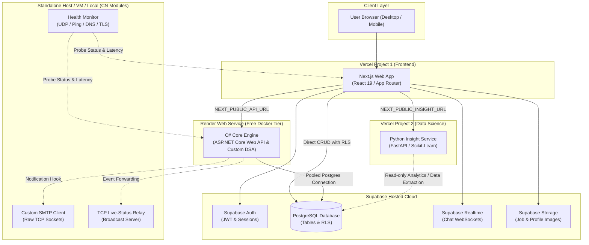

# ProLink System Architecture

This document describes the high-level architecture, module responsibilities, deployment topologies, cross-service contracts, and core design principles of the ProLink platform.

---

## 1. Architecture Diagram



---

## 2. Concern -> Where It Lives

| System Concern | Responsible Service / Location | Details & Protocols |
| :--- | :--- | :--- |
| **Signup, Login, Password Reset, Sessions** | **Supabase Auth** | Handled directly via `@supabase/supabase-js` / `@supabase/ssr` returning signed JWTs. |
| **Simple Reads & Writes (Profiles, Bookmarks, Basic Queries)** | **Next.js $\rightarrow$ Supabase Postgres** | Direct queries secured by PostgreSQL **Row Level Security (RLS)** policies. |
| **Realtime Chat & Messaging** | **Supabase Realtime** | WebSocket channels subscribed directly from the browser / Next.js client. |
| **Job State Transitions & Offer Negotiation** | **C# Core Engine (`api/`)** | Complex state machines (Open $\rightarrow$ Assigned $\rightarrow$ In-Progress $\rightarrow$ Completed $\rightarrow$ Reviewed). |
| **DSA-Based Matching & Top-K Ranking** | **C# Core Engine (`api/`)** | In-memory custom algorithms (Trie autocomplete, Inverted Index search, Min-Heap / Priority Queue top-K matching, Dijkstra distance). |
| **Rate Limiting & Abuse Prevention** | **C# Core Engine (`api/`)** | Custom sliding-window rate limiter on transactional endpoints. |
| **Category Suggestions & Text Classification** | **Python Insight Service (`insight/`)** | NLP/scikit-learn category classifier exposed via FastAPI. |
| **Advanced Analytics & ML Scoring** | **Python Insight Service (`insight/`)** | Data extraction, aggregations, trend analytics, and model training. |
| **Synthetic Dataset Generation & EDA** | **Python Insight Service (`insight/`)** | Faker generation scripts and documented Jupyter notebooks (`insight/notebooks/`). |
| **Transactional Email Notifications** | **CN Modules (`network/smtp-client/`)** | Custom RFC 5321 socket-level SMTP client. |
| **Service Latency & Uptime Health Monitoring** | **CN Modules (`network/health-monitor/`)** | UDP heartbeat listener, ICMP ping latency monitor, DNS lookup and TLS handshake measurement. |
| **Realtime Status Broadcast Fan-out** | **CN Modules (`network/tcp-relay/`)** | Optional standalone TCP socket server. |
| **File Storage (Job photos, Avatars)** | **Supabase Storage** | S3-compatible object buckets with RLS access policies. |

---

## 3. Deployment Map

```text
┌────────────────────────────────────────────────────────────────────────┐
│                              DEPLOYMENT MAP                            │
├────────────────────────┬───────────────────────────────────────────────┤
│ Component              │ Hosting Provider & Configuration              │
├────────────────────────┼───────────────────────────────────────────────┤
│ web/ (Next.js)         │ Vercel Project 1 (Root Directory = web)       │
│ insight/ (FastAPI)     │ Vercel Project 2 (Root Directory = insight)   │
│ api/ (C# Core Engine)  │ Render Web Service (Free Tier Docker deploy)  │
│ db/ (Postgres / Auth)  │ Supabase Hosted Cloud (managed database/auth) │
│ network/ (CN Modules)  │ Standalone VM / Local Host (not on Vercel)    │
└────────────────────────┴───────────────────────────────────────────────┘
```

### Hosting Characteristics & Constraints
- **Vercel**: Hosts the Next.js frontend and Python FastAPI Insight Service as stateless serverless functions.
- **Render (Free Tier)**: Runs the Dockerized C# Core Engine. *Note: Free instances spin down after ~15 minutes of inactivity; initial cold-start requests may incur a 30–50 second delay.*
- **Supabase (Free Tier)**: Free tier databases pause after 7 days of inactivity.
- **Network Modules**: Raw TCP and UDP listener sockets cannot bind inside Vercel's serverless runtime. Therefore, all `network/` modules run locally or on a dedicated virtual machine.

---

## 4. Backend Swap Note

> [!IMPORTANT]
> **Backend Swap-ability Guarantee (C# $\rightarrow$ Python)**
> The C# Core Engine may later be replaced with an all-Python backend if project requirements evolve. The repository is intentionally designed to make this transition seamless:
> 1. **Decoupled API Contract**: The frontend communicates exclusively with the backend via `NEXT_PUBLIC_API_URL` and JSON schemas specified in `docs/api/`. The frontend makes no C#-specific assumptions.
> 2. **Migration Path**: If the C# backend is decommissioned:
>    - The matching, DSA structures, and business logic will be ported to Python under `insight/` (or a dedicated Python API module).
>    - The `api/` directory and Render Docker service will be retired.
>    - The frontend will point `NEXT_PUBLIC_API_URL` to the Python backend endpoint.
>    - No frontend code restructuring or database migration will be required.

---

## 5. Architectural Rules & Governance

1. **Strictly Two Backend Services**:
   - Primary Backend: C# Core Engine (or its drop-in Python replacement) for state management and DSA matching.
   - Analytics/DS Backend: Python FastAPI Insight Service for ML, analytics, and classification.
2. **No Business Logic in Next.js API Routes**:
   - Next.js is strictly a presentation and SSR layer. Complex workflows, offer transactions, and DSA scoring must never be implemented inside Next.js Route Handlers.
3. **Zero Secrets in Frontend**:
   - The `SUPABASE_SERVICE_ROLE_KEY` and database credentials must only exist in backend server environments and are never exposed in `web/` or client bundles.
4. **Mandatory JWT Verification**:
   - The C# Core Engine validates the Supabase JWT on every authenticated request, verifying identity and roles before executing business logic.
5. **Database as Single Source of Truth**:
   - All schema mutations must be committed to `db/migrations/` before being executed against the hosted database.
